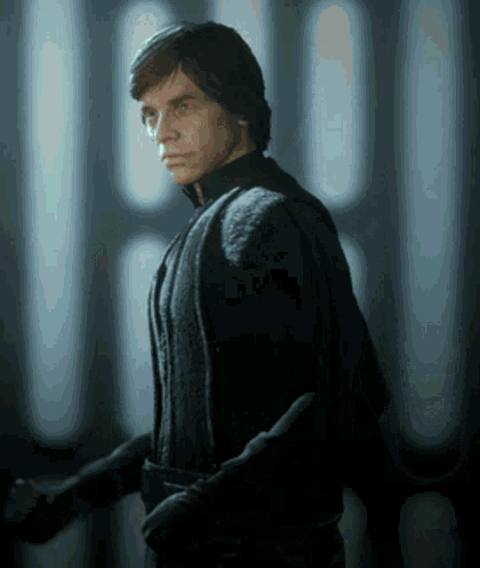

# Character-Based Text Generation and Classification
## Features
* Text generation program emulating <b> Michael Scott, Luke Skywalker, and Phoebe Buffay </b>
* Built using bigram model with discount, achieving <b>66% accuracy and 8.3 perplexity</b>
* Naive Bayes classifier for labeling generated sentences with their respective characters

## Example Generated Sentences
### Phoebe Buffay

  

* thank you ' d be great but i got . it ?
* i wanted to read the purses ! good bye !
  
### Luke Skywalker

  

* i feel the force and will .
* vader my father . 

### Michael Scott

  

* no no , i don ' t even the uh , hey . they embarrassed my my girlfriend
* yes yes , the thing . nothing here . whatever . another living . . one penny . . 

## Perplexity vs Discount Graph

   
  <i> Lowest perplexity when discount is lowest - Generated text does not contain unknown words, so higher discount leads to higher perplexity</i>

## Credits
Developed by Grace Everts & Pine Netcharussaeng as fincal project for CS159 Natual Language Processing. Thank you to Dr. Dave Kauchak for advising us on this project!
